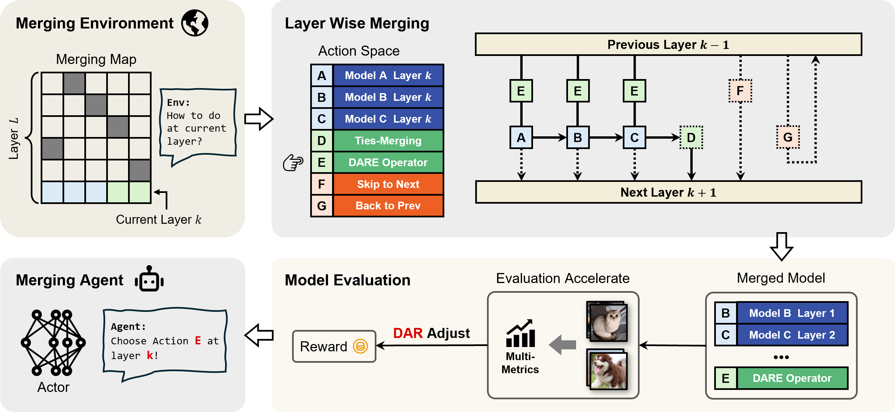

# Reinforced Model Merging
Code for paper "Reinforced Model Merging"。


<div align="center">
</img> 
</div>


## Quick Start

Here we provide a quick start for RMM.

All you need is to **Train** the models and **Merge** them as you want.

### Merge ViT-B/16 on CUB-200 & Stanford Dogs datasets

#### 1. Fine-tune Models 
```bash
python finetune_CV.py --model vit_b --dataset cub
python finetune_CV.py --model vit_b --dataset dogs
```

#### 2. Merge Models
```bash
python train_RLM.py --model vit_b --method ties --dataset cub,dogs --data_scale 0.1
# merging method [ties,dare,dare_ties]
# set smaller data_scale for faster merging
```